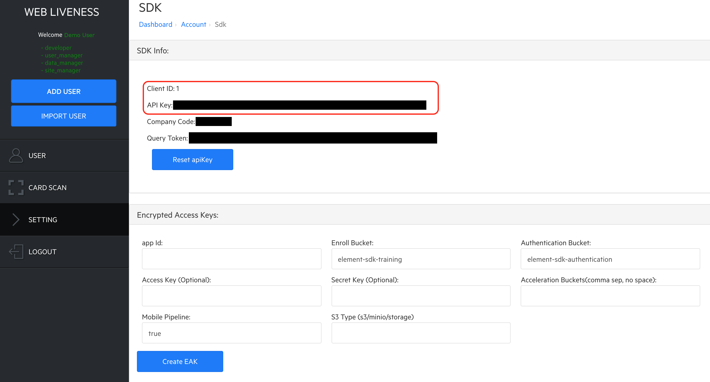
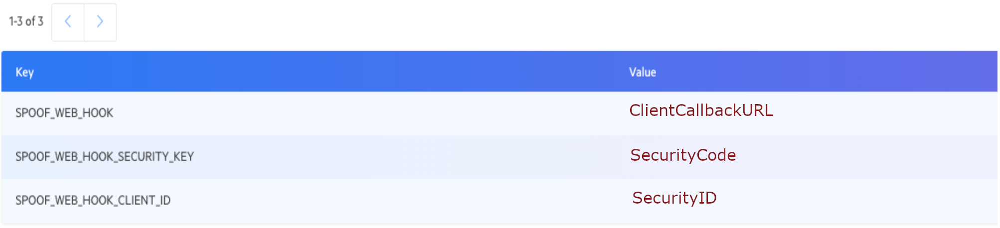

# Element Web-Based eKYC Documentation

The Element web-based eKYC pipeline allows the liveness check and digital user onboarding on a browser-based platform. This document contains instructions to access and integrate the Element web-based eKYC functionalities. Please note that the examples in this document use the Element Web eKYC and face matching backend for a quick setup and system integration.

# Version
C001-1.9.8

# Device and Browser Support
The current version supports the Chrome browser on Android and Safari on iOS 11.0+.

# Prerequisites
## Element Web eKYC Server
The Element Web eKYC server hosts the Element Web APIs required for the user digital onboarding and verification process. It is also paired with the Element Face Matching Dashboard described below.

## Element Face Matching Dashboard
The Element Dashboard is the backend server which provides endpoints associated with the Element Web API. The URL of the Element Dashboard is defined by your Element backend setup. An administration account is required to access the Element Dashboard. Please contact Element for more information.

## Client ID and API Key
The Client ID and API Key parameters will be required for the Element Web UI app to communicate with the Element backend. They can be retrieved through the following steps:

1. Log into the Element Dashboard with your registered account.
1. Select the `SETTING` tab on the left navigation panel.
1. Find the `SDK` menu and click the `View` button next to it.
1. The Client ID and API Key strings are displayed in the `SDK Info` section.

## TIMESTAMP and HASHTOKEN
Once the above CLIENTID and APIKey strings are retrieved, you can get the TIMESTAMP and HASHTOKEN parameters through the following steps.

1. Take the current timestamp in milliseconds, e.g., 1589932144123.
1. Go to https://web_ekyc_server/package/page/token.html, where  web_ekyc_server is the host server address and package is the application name.
1. Input ApiKey, timestamp and txnId mentioned above, and then click the Generate Token button.
1. The HASHTOKEN string will appear in the token field.

# Link Address
The URL link consists of multiple fields, including the transaction Id, user Id, CLIENTID, TIMESTAMP and HASHTOKEN, e.g., [https://web_ekyc_server/package/page/liveness_check.html?txnId=txn001&userId=user001&CLIENTID=100&TIMESTAMP=1610981479694&HASHTOKEN=MaKF6qwYwRc3qRPIBvHQx5zRLfl5IQ8J74SoYWwF4MQ=&apiKey=dkhqOVlvWGt1T1YxV1p3R2pxeVhReVJUUElvaThpbHVpdmZvRnBVUDhkaERtUEZx&action=(enroll/auth)&apiURL=fm server](https://web_ekyc_server/package/page/liveness_check.html), where web_ekyc_server is the host server address, package is the application name, and fm_server is the application-specific backend server provisioned by Element respectively.

In the above URL, both txnId and userId parameters are required to index each transaction. These Id parameters will be needed for troubleshooting and support purposes.

The CLIENTID, TIMESTAMP and HASHTOKEN parameters are all mandatory to ensure security.

If the above parameter strings contain any special characters please make sure they are URL-encoded.

# Steps for User Enrollment
1. Use the above URL address with action=enroll to initiate the user enrollment process.

2. It will prompt the user to take selfie and ID images in the following steps,

   1. An enrollment page will appear to show a live camera view along with a face stencil to take user selfies.

   2. A message dialog will pop up to show the liveness check result whether it is successful or needs a retry.

   3. Once selfies are taken, another camera page will appear to show the rear facing camera view along with a card stencil to scan the ID.

   4. After the card image is taken, a message dialog will pop up to show the ID scan result.

If there is any issue experienced, note down the txnId and userId and send them to the Element team for troubleshooting.

# Steps for User Verification
1. Use the above URL address with action=auth to initiate the user verification process, which will prompt the user to follow the instructions.

2. A verification page will appear to show a live camera view along with a face stencil for the user to take selfies.

3. After the selfie images are processed, a message dialog will pop up to show the verification result.

If there is any issue experienced, note down the userId and txnId and send them to the Element team for troubleshooting.

# Steps to Set Up Webhook
To return the user enrollment and verification results back to the integration system, a webhook approach is used on the server side for security purposes.

1. Log into the Element Dashboard with your registered account.

2. Select `SETTING` and `Config`.

3. Add the following three keys:

   * SPOOF_WEB_HOOK

   * SPOOF_WEB_HOOK_CLIENT_ID

   * SPOOF_WEB_HOOK_SECURITY_KEY

Server will call the SPOOF_WEB_HOOK URL to return a response json.

Security related features can be enabled by setting SPOOF_WEB_HOOK_CLIENT_ID and SPOOF_WEB_HOOK_SECURITY_KEY.
