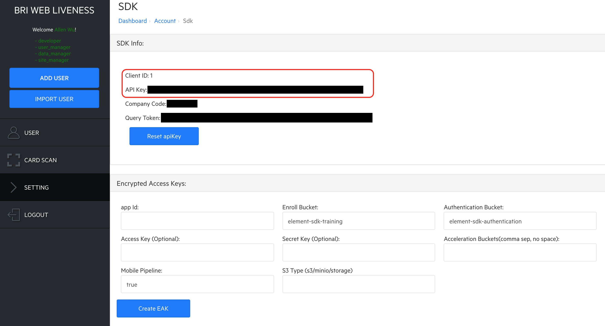
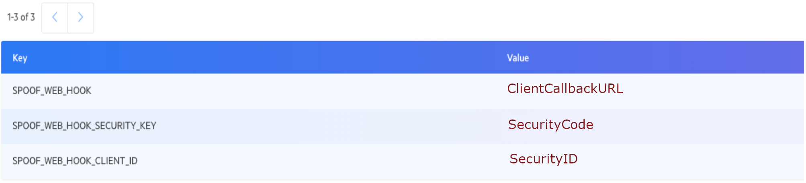

# Element Web Liveness

This documentation shows the main steps of the Element Web Liveness usage.

# Version
C001-0.8.0

# Device and Browser Support
The current version supports the Chrome browser on Android and Safari on iOS.

# Prerequisites
## Element Dashboard
The Element Dashboard is a gateway to the assets in order to use the Element Web API. The URL of the Element Dashboard is associated with your Element backend setup. An administration account is required to access the Element Dashboard. Please contact Element for more information.

## Client ID and API Key
The Client ID and API Key will be required for the Element Web UI app to communicate with the Element backend. They can be retrieved through the following steps:

1. Log into the Element Dashboard with your registered account.
1. Select the `SETTING` tab on the left navigation panel.
1. Find the menu item, `SDK`, and click the `View` button next to it.
1. In the `SDK Info` section, you can see the Client ID and API Key strings.

## TIMESTAMP and HASHTOKEN
Once the above CLIENTID and APIKey are retrieved, you can get TIMESTAMP and HASHTOKEN through the following steps.

1. Take the current timestamp in milliseconds, e.g., 1589932144123.
1. Go to https://server_address:port/web/liveness/page/token.html.
1. Input the ApiKey, timestamp and txnId parameters, and click the `Generate Token` button.
1. The HASHTOKEN string will appear in the `token` field.

# Link Address
The general format of the URL link is
https://server_address:port/web/liveness/page/liveness_check.html?txnId=xxxxxx&userId=xxxxx&CLIENTID=xxx&TIMESTAMP=xxxxxxxxxxxxx&HASHTOKEN=xxxxxxxxxxxxxxxxxxxxxxxx, where server_address and port are the IP address and port number of an application-specific server provisioned by Element respectively.

In the above URL, the txnId parameter is mandatory and should be a unique ID to index each transaction. This ID will be used for troubleshooting and support purposes.

The CLIENTID, TIMESTAMP and HASHTOKEN are all required to ensure security.

The userId is not mandatory but strongly recommended for troubleshooting and support purposes.

Also a kind reminder to make sure your parameter strings are url-encoded if they contain special characters.

# General Flow of Liveness Check
1. Take the above address to open the liveness page.
1. A camera page will appear to show a live video view along with a face stencil.
1. Follow the guided steps on the screen to capture images automatically.
1. A message box will pop up to show the liveness check result.

You can simply refresh the page to try again. If any issue is experienced, please note down the txnId and send it to the Element team for troubleshooting.

# Steps to Set Up Webhook
For a simple integration, the liveness detection results can also be returned via a webhook approach.

1. Login the Element Dashboard https://server_address/login
2. Got to Setting->Config
3. Add 3 keys:

  - SPOOF_WEB_HOOK

  - SPOOF_WEB_HOOK_CLIENT_ID

  - SPOOF_WEB_HOOK_SECURITY_KEY

The server will call the SPOOF_WEB_HOOK URL to return the response json.

Please note that SPOOF_WEB_HOOK_CLIENT_ID and SPOOF_WEB_HOOK_SECURITY_KEY will be required to enable security related features.
